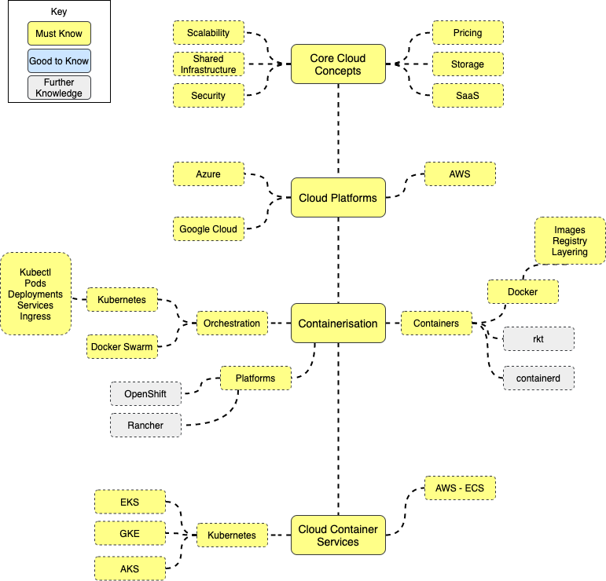

# Cloud Native Engineer Quest

What makes a Cloud Native Engineer, or more importantly a _good_ Cloud Native Engineer? 

## Roadmap

## Resources
### Core Concepts
  * [Pluralsight Cloud Computing - The Big Picture](https://app.pluralsight.com/library/courses/cloud-computing-big-picture/table-of-contents)
  * [Pluralsight Fundamentals of Cloud Computing](https://app.pluralsight.com/library/courses/cloud-computing-fundamentals/table-of-contents)
  * [Principles of Cloud Computing](https://docs.microsoft.com/en-us/learn/modules/principles-cloud-computing/)

### Cloud Platforms
  * [Pluralsight AWS Certified Cloud Practitioner Path](https://app.pluralsight.com/paths/certificate/aws-certified-cloud-practitioner)
  * [Pluralsight AWS Certified Solutions Architect – Associate Path](https://app.pluralsight.com/paths/certificate/aws-certified-solutions-architect-associate)
  * [Pluralsight AWS Certified Developer – Associate Path](https://app.pluralsight.com/paths/certificate/aws-certified-developer-associate)
  * [Pluralsight Google Cloud Certified Associate Cloud Engineer Path](https://app.pluralsight.com/paths/certificate/cloud-engineering-with-google-cloud)
  * [Pluralsight Microsoft Azure Fundamentals Path](https://app.pluralsight.com/paths/certificate/microsoft-azure-fundamentals-az-900)
#### AWS
* [Identity Access Management (IAM) - AWS Documentation](https://docs.aws.amazon.com/IAM/latest/UserGuide/introduction.html)
* [Elastic Compute Cloud (EC2) - AWS Documentation](https://docs.aws.amazon.com/ec2/?id=docs_gateway)
* [Virtual Private Cloud (VPC) - AWS Documentation](https://docs.aws.amazon.com/vpc/?id=docs_gateway)
* [Route53 - AWS Documentation](https://docs.aws.amazon.com/ec2/?id=docs_gateway)
* [Simple Storage Service (S3) - AWS Documentation](https://docs.aws.amazon.com/s3/?id=docs_gateway)
* [Simple Queue Service (SQS) - AWS Documentation](https://docs.aws.amazon.com/sqs/?id=docs_gateway)
* [Simple Notification Service (SNS) - AWS Documentation](https://docs.aws.amazon.com/sns/?id=docs_gateway)
* [Relational Database Service (RDS) - AWS Documentation](https://docs.aws.amazon.com/rds/?id=docs_gateway)
* [DynamoDB - AWS Documentation](https://docs.aws.amazon.com/dynamodb/?id=docs_gateway)

### Containerisation
  * [Pluralsight Getting Started with Docker](https://app.pluralsight.com/library/courses/docker-getting-started/table-of-contents)
  * [Pluralsight Docker Deep Dive](https://app.pluralsight.com/library/courses/docker-deep-dive-update/table-of-contents)
  * [Pluralsight Docker Swarm: Native Docker Clustering](https://app.pluralsight.com/library/courses/docker-swarm-native-docker-clustering/table-of-contents)
  * [Pluralsight Getting Start with Kubernetes](https://app.pluralsight.com/library/courses/kubernetes-getting-started/table-of-contents)
  * [Pluralsight Certified Kubernetes Application Developer (CKAD) Path](https://app.pluralsight.com/paths/certificate/certified-kubernetes-application-developer-ckad)
  * [Pluralsight Certified Kubernetes Administrator (CKA) Path](https://app.pluralsight.com/paths/certificate/certified-kubernetes-administrator)
  * [Rkt](https://coreos.com/rkt/)
  * [containerd](https://containerd.io/)
  * [OpenShift](https://www.openshift.com/)
  * [Rancher](https://rancher.com/)

## Certifications
  * [AWS Certified Cloud Practitioner](https://aws.amazon.com/certification/certified-cloud-practitioner/)
  * [AWS Certified Solutions Architect - Associate](https://aws.amazon.com/certification/certified-solutions-architect-associate/)
  * [AWS Certified Developer - Associate](https://aws.amazon.com/certification/certified-developer-associate/)
  * [Google Associate Cloud Engineer](https://cloud.google.com/certification/cloud-engineer)
  * [Microsoft Azure Fundamentals](https://docs.microsoft.com/en-us/learn/certifications/azure-fundamentals)
  * [Certified Kubernetes Administrator (CKA)](https://www.cncf.io/certification/cka/)
  * [Certified Kubernetes Application Developer (CKAD)](https://www.cncf.io/certification/ckad/)

## Engineer Suggestions
  * Learning docker concepts before moving onto something like Kubernetes is a huge help in understanding core concepts
  * Kubernetes CKA & CKAD exams are all practical, so gaining lots of hands-on experience with Kubernetes (kubectl) commands will really help for the exam