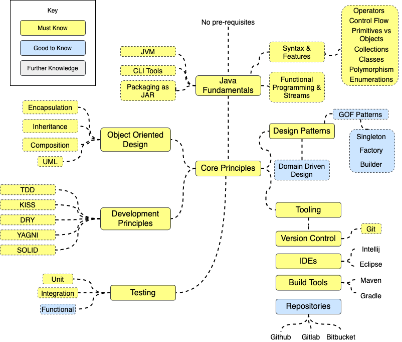

# Java Engineer

What makes a Java Engineer, or more importantly a _good_ Java Engineer? 

## Roadmap

## Resources
### Core Java
  * [Pluralsight Java Path](https://www.pluralsight.com/paths/java)

### Development Principles 
  * [Don't repeat yourself](https://en.wikipedia.org/wiki/Don%27t_repeat_yourself) (Wikipedia)
  * [SOLID](https://en.wikipedia.org/wiki/SOLID_(object-oriented_design)) (Wikipedia)
  * [You Ain't Gonna Need It](https://en.wikipedia.org/wiki/You_aren%27t_gonna_need_it) (Wikipedia)
  * [Keep it Simple (Stupid)](https://en.wikipedia.org/wiki/KISS_principle) (Wikipedia)

### Object Oriented Design
  * [Scott Ambler's Agile Modelling site](http://agilemodeling.com/) - specifically ["Start Here"](http://agilemodeling.com/essays/whereDoIStart.htm) and ["Best Practices"](http://www.agilemodeling.com/essays/bestPractices.htm), as well as specific pages on [Use Case Diagrams](http://agilemodeling.com/artifacts/useCaseDiagram.htm), [Class Diagrams](http://agilemodeling.com/artifacts/classDiagram.htm),  [Sequence Diagrams](http://agilemodeling.com/artifacts/sequenceDiagram.htm), [State-Transition/State Machine Diagrams](http://agilemodeling.com/artifacts/stateMachineDiagram.htm)

### Design Patterns
  * [Head First Design Patterns](https://www.safaribooksonline.com/library/view/head-first-design/0596007124) (O'Reilly) - Sections "1. Intro to Design Patterns", "4. The Factory Pattern", "5. The Singleton Pattern", "12. Compound Patterns - MVC"

### Unit Testing
  * [JUnit 5 User Guide](http://junit.org/junit5/docs/current/user-guide/) - sections: "Writing Tests", "Running Tests"
  * [Lars Vogel's "Using Hamcrest for Testing"](http://www.vogella.com/tutorials/Hamcrest/article.html) (Blog)
  * [John Nash's "Stylish Unit Tests" Blog](https://capgemini.github.io/development/unit-test-structure/) (Blog)

### IDE's
  * Read the [Jetbrains IntelliJ Blog](https://blog.jetbrains.com/idea/)
  * [Default Keymap](https://resources.jetbrains.com/storage/products/intellij-idea/docs/IntelliJIDEA_ReferenceCard.pdf) - Cheatsheet
  * [Jetbrains Video Tutorials](https://www.jetbrains.com/idea/documentation/) - Online Video Series

### Build Tools
  * [Maven Getting Started Guide](https://maven.apache.org/guides/getting-started/index.html) - covers all topics above
  * [Maven the Complete Reference (O'Reilly)](https://books.sonatype.com/mvnref-book/reference/) - covers all the topics above 

### Version Control
  * [Code Academy: Learn Git](https://www.codecademy.com/learn/learn-git)
  * [Learn Git Branching](https://learngitbranching.js.org/)

## Certifications
  * [Oracle Java Certifications](https://education.oracle.com/java-and-dev-tech/java-se/product_267?certPage=true)

## Engineer Suggestions
  * Check out Uncle Bob's [Clean Coder Videos](https://cleancoders.com/videos) 