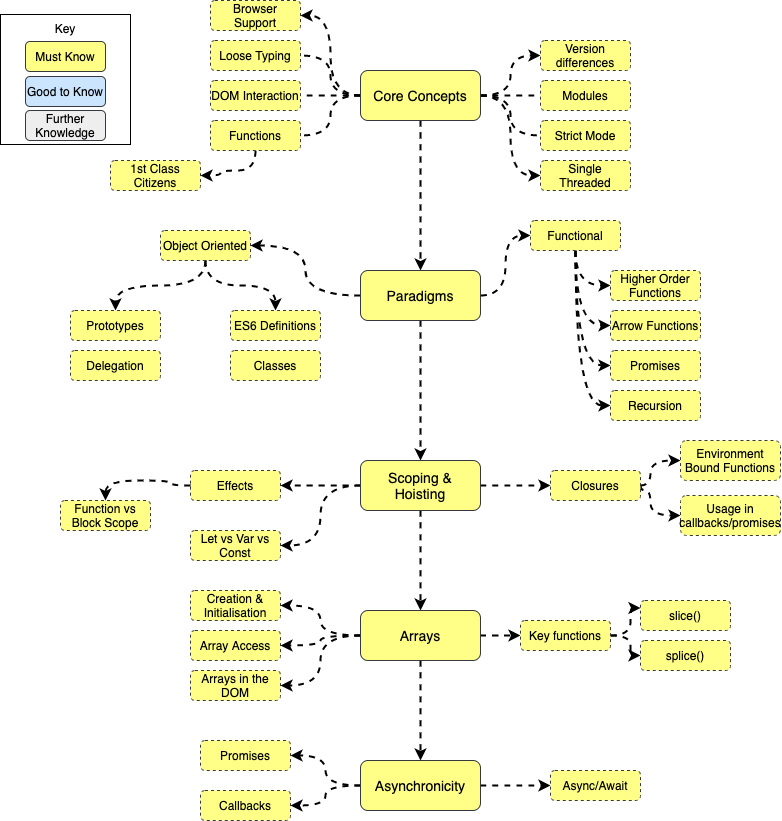

# Java Quest

What makes a JavaScript Engineer, or more importantly a _good_ JavaScript Engineer? 

## Roadmap

## Resources

### Core JavaScript
  * [Pluralsight JavaScript Path](https://app.pluralsight.com/paths/skill/javascript-core-language)
  * [FreeCodeCamp JavaScript Tutorials](https://www.freecodecamp.org/news/my-giant-javascript-basics-course-is-now-live-on-youtube-and-its-100-free-9020a21bbc27/)
  *  [Eloquent JavaScript PDF](https://eloquentjavascript.net/Eloquent_JavaScript.pdf)

### Advanced JavaScript  
  * [Learning Advanced JavaScript](https://johnresig.com/apps/learn/)

### Scoping/Hoisting
  * [Scoping and Hoisting](http://www.adequatelygood.com/JavaScript-Scoping-and-Hoisting.html)
  * [Function Scope And Variable Hoisting In JavaScript](https://derickbailey.com/2015/02/02/function-scope-and-variable-hoisting-in-javascript/)

### Object Oriented JavaScript
  * [JavaScript Prototypical Inheritance Explained](https://www.htmlgoodies.com/html5/tutorials/javascript-prototypical-inheritance-explained.html#fbid=jqCzp_1o7UI)
  * [Eloquent JavaScript - Object Oriented Programming](https://eloquentjavascript.net/1st_edition/chapter8.html)

### Functional JavaScript
  * [Map, Filter & Reduce](http://cryto.net/~joepie91/blog/2015/05/04/functional-programming-in-javascript-map-filter-reduce/)
  * [Reduce Data with JavaScript](https://egghead.io/courses/reduce-data-with-javascript-array-reduce)
  * [Functional Programming in JavaScript](http://reactivex.io/learnrx/)

### Web Development 
  * [Modern JavaScript for Ancient Web Developers](https://postlight.com/insights/modern-javascript-for-ancient-web-developers)
  * [Organising Code](https://github.com/verekia/js-stack-from-scratch/tree/master/tutorial)
  * [Eloquent JavaScript - The Document Object Model](https://eloquentjavascript.net/14_dom.html)

### Useful Links
  * [Mozilla Development Docs - JavaScript](https://developer.mozilla.org/en-US/docs/Web/JavaScript)
